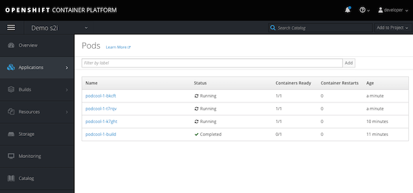

# Deploying an App

To deploy this sample Python web application from the OpenShift developer console and using the _Add to project_ button, you should select ``python:2.7``, ``python:3.3``, ``python:3.4`` or ``python:latest``. Use of ``python:latest`` is the same as having selected the most up to date Python version available, which at this time is ``python:3.4``.

The HTTPS URL of this code repository which should be supplied to the _Git Repository URL_ field when using _Add to project_ is:

* https://github.com/williamcaban/podcool.git

## Deploying demo app with the ``Developer Console``
Access your OpenShift or OKD environment. Your _developer console_ will be available in a path like this:

```
https://<your-okd-ip-address>:8443/console/
```

If using _Minishift_ login as _developer_ with password _developer_. 


Once logged in you will have the _developer console_


Press the ``Create Project`` button to create a new project with name ``demo-s2i``


Once the project is create. Click the name of the new project:


This will bring you to the general _Overview_ panel of the _Developer Console_.


OpenShift provides multiple ways to deploy or onboard applications. For this demo we are going to use s2i where. For this go to the top right ``Add to Project > Browse Catalog``


This will present the full catalog. Choose the _Languages_ tab to norrow the list and choose _Python_. Inside the _Python_ languages choose the _Python_ item.


 
This will run the wizard to deploy a Python based application.


Click _Next_ to fill the information about the application.


For this particular example use the following values:
- Version: 3.6
- Applicton Name: podcool
- Git Repository: https://github.com/williamcaban/podcool.git

Click _Create_ to initiate the build process.


Click the _Overview_ tab on the left column. Click the ">" arrow to see the details of the build process.


You can see several things which OpenShift takes care automatically:
- OpenShift s2i process download the source code into a build container, download the dependencies and setup the configuration to serve the Python application. A new Python based container image with the "compiled" application and its dependencies is build and store in the local registry.

    _NOTE: Technically there is not an actual tradiitonal "compile" process in Python but s2i will compile dependencies that may be required by the __pip install__ process._
- OpenShift deploy a ``pod`` using the newly build container of the application
- OpenShift create a ``Service`` object for the application pod or pods
- OpenShift create a ``route`` to expose the application to receive external traffic.

Once the container is build and a pod deployed you will see a blue ring with a number indicating the number of pods deployed for the application


Click the HTTP route to access the demo app


The demo app display a simple page with the name of the pod and the version of the application.

## Scaling the App
Horizontal scalability of the demo app is as simple as clicking the "up arrow" to the right of the pod.


The new desired number of pods will be displayed and the blue ring will fill as these are created and get into running state.

The OpenShift ``route`` does not change but the traffic is distributed equaly among the pods.

If using different browsers to open sessions to the demo URL, you will see different pods names serving the request.

From CLI, using ``curl`` you may see something like this:
```
...
Hello from podcool-1-t7rqv v1
Hello from podcool-1-k7ght v1
Hello from podcool-1-bkcft v1
...
```

## Accessing the Pods
To access the list of pods frome the _Developer Console_ go to ``Applications > Pods``. 



In the list you will notice a pod with the "-build" suffix. That is the special pod used by OpenShift to do the actual build process (git clone, install dependencies, etc) of the application and create the final container image.

Select one of the pods in _Running_ state to see the details.


From this view you can access pod logs, events and even open a terminal session to the pod.

Click the _Terminal_ tab to open an interactive session to the pod.


This is an option to troubleshoot running containers.

Explore the build image and resulting container by going to ``Builds > Builds``


Explore additional features and options under the Applications & Buids menus. 

## Delete Project
Once ready to remove the project, return to the main console and select the option from the menu by the name of the specific project.

