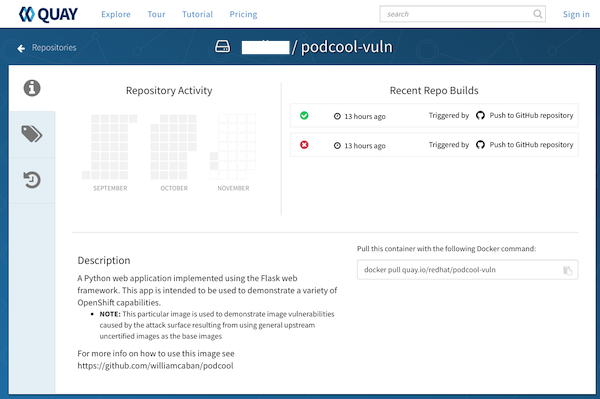
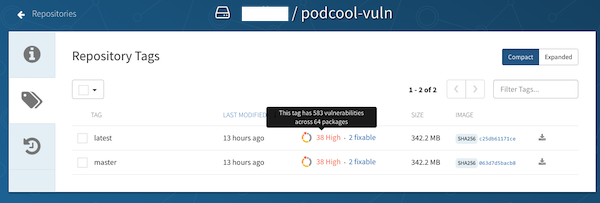
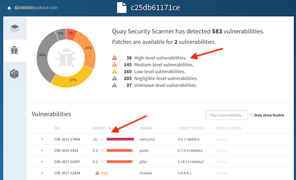
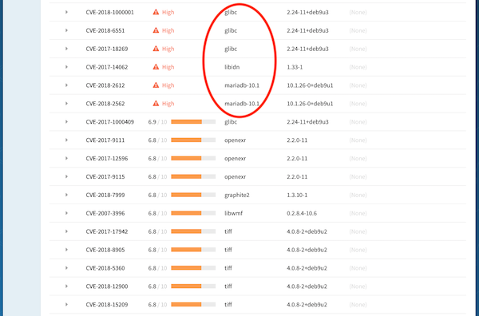
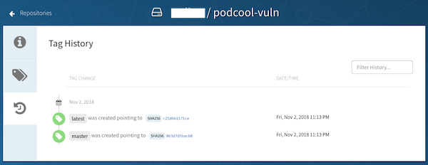

# Dry run Overview of Quay

``Quay`` is an enterprise-ready container and application registry. Quay.io is the public registry service run by the _Quay engineering team_. It is the same code based as the Quay Enterprise offering.


Some of the Quay container and application registry features and capabilities are:
- Geo Replication
- High availability & scalability
- Security Scanning
- Automatic Build Triggers
- Time Machine for Image Rollback
- Fine-grained access controls
- Detailed logging & auditing
- Automatic, continuous garbage collection with NO downtime 
- Integrates with multiple storage back ends
- Multiple identity providers supported: LDAP, OAuth, OpenStack Keystone, etc.
- Encrypted CLI passwords
- Torrent Distribution
- Container & Application Registry
- Consistent UI & Codebase between Quay Enterprise and Quay.io


Visit the [Quay-docs github repository](https://github.com/coreos/quay-docs) for the latest documentation.

# The Attack Surface of the Container
The [podcool](https://github.com/williamcaban/podcool) git repo has been setup to generate two different container images in Quay.io. The difference between these two containers images is the source _Dockerfile_ used to generate them. The application source code is identical for both.

In this case, both _Dockerfiles_ are using an official Docker upstream base images provided at Docker Hub.

The difference between the _Dockerfiles_ is the following:

### podcool
The ``podcool`` image use the ``latest`` Docker Hub Python 3 Alpine base image which has a very small attack surface. The resulting image is 85MB.

```
FROM python:3-alpine
```

The *podcool* container image use the [/Dockerfile](https://github.com/williamcaban/podcool/blob/master/Dockerfile) from the podcool repo. The resulting _container_ is available here:

[](https://quay.io/repository/redhat/podcool)

### podcool-vuln
The ``podcool-vuln`` image use the ``latest`` Docker Hub Python 3 _standard_ image. This one is based on Ubuntu and, unfortunately, carries an unnecesary large attack surface. The resulting image is 342MB.

```
FROM python:3
```

The *podcool-vuln* container image use the [/Dockerfile-vuln](https://github.com/williamcaban/podcool/blob/master/Dockerfile-vuln) from the podcool repo. The resulting _container_ is available here:

[](https://quay.io/repository/redhat/podcool-vuln)

## Steps for Guided Overview

***NOTE:*** Expect a difference between the screenshots and the day you visit them as the containers are automatically rebuild with every new commit. The security scanning of the new containers is queued for asynchronous processing of the images. There might be more or there might be less or there might be no security issues based on the maintainance of the upstream base image.

1. Visit the container image at[https://quay.io/repository/redhat/podcool-vuln](https://quay.io/repository/redhat/podcool-vuln)



- The initial tab provides a general view of the activities and state of the container image.

2. The ``Tags`` tab list all the valid tags for a particular container. 



- If the security scanning has been completed, it will notify of the resuls. In this example the scanner has identified 38 high-level (or critical) vulnerabilities out of a total of 583 that were found.

3. Should the scanner detect vulnerabilities, click on the number to have a detailed view of these.



- In this particular example we can see some of the critical vulnerabilities found in the container image.



- From the High-level vulnerabilities most are not libraries or tools necesary to run the demo application but were present by the default in the upstream Python Docker Hub image.

    - This is a good example on how critical it is for the onboarding process of applications to have capabilities in place to scan and certify the container images before deploying them into production.

4. The final tab is the History view where we can find the detailed history of the ``Tags``



# Best Practices Considerations
Some of the considerations when establishing your containers base images are:
- Consider the use of _Certified Base Images_ (do not trust upstream images, always scan them)
- Restrict the direct use of upstream container images into production.
    - A single upstream compromised base image may compromise your whole environment
- Provide your own organization's vetted customized containers images for your developers.
    - Keep CI/CD pipelines in place to trigger automatic rebuilds based on changes of the certified based images
- Maintain processes in place to always scan (and if possible, sign) your containers prior accepting them into production
