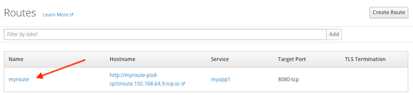
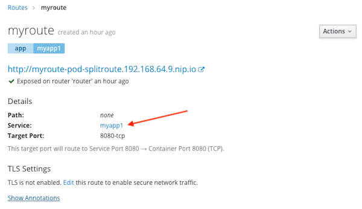
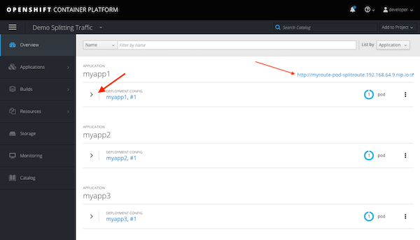
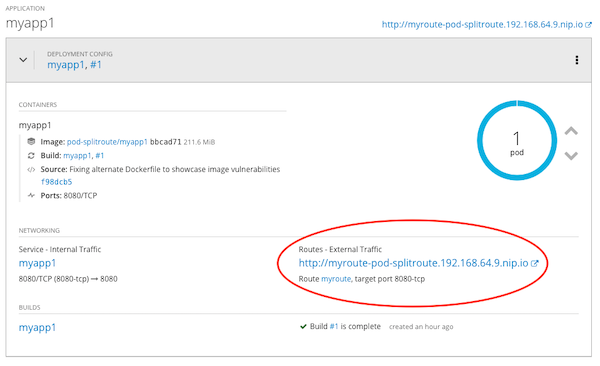
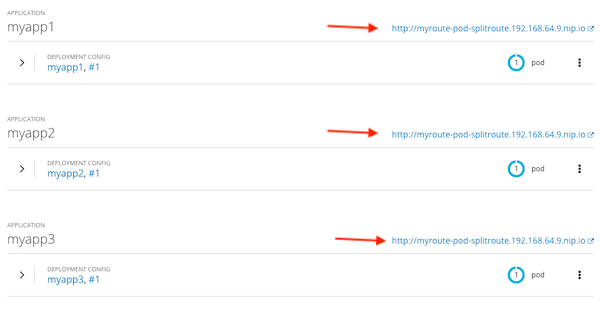
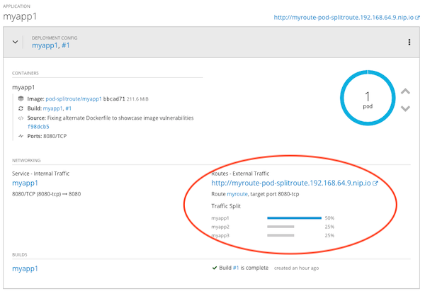

# Splitting Traffic Among App Versions
Sometimes there is the need to release a new version of the application in parallel to the current version. There are multiple scenarios where this can be useful:

- A/B Testing
- Canary release
- Blue/Green deployment


## Initial setup
Setup a project for this test, deploy the ``podcool`` app and create the external route for it.
```
# Create new project
oc new-project pod-splitroute --display-name='Demo Splitting Traffic'

# Deploy new podcool app
oc new-app https://github.com/williamcaban/podcool.git --name=myapp1 --strategy=source

# Create external route
oc expose svc/myapp1 --name=myroute
```

## Monitor the availability of the route
***In a different terminal*** run the following loop to get the text output displaying the name of the pod and the version of the app handling the request.  Use the _/hello_ path to get the desired output.

Run the following loop ***in another terminal***:
```
while sleep 1; do curl -w "\n" http://$(oc get route myroute --template='{{ .spec.host }}'/hello); done
```

The output should display a _Hello_ message with the _name_ of the pod and _version_ of the application similar to this:

```
$ while sleep 1; do curl -w"\n" http://$(oc get route myroute --template='{{ .spec.host }}'/hello); done
Hello from myapp1-1-gx9vs v1
Hello from myapp1-1-gx9vs v1
Hello from myapp1-1-gx9vs v1
Hello from myapp1-1-gx9vs v1
Hello from myapp1-1-gx9vs v1
```

Leave this loop running the terminal and return to the original terminal with the OpenShift client to continue the lab.


## Deploy Additional Versions of the Application
Using the _podcool_ demo app features deploy two additional versions of the app

```
oc new-app https://github.com/williamcaban/podcool.git --name=myapp2 --strategy=docker APP_VERSION=v2

oc new-app https://github.com/williamcaban/podcool.git --name=myapp3 --strategy=docker APP_VERSION=v3
```

## The OpenShift ``route`` Object
A route is a FQDN with its corresponding _service selector_ to map to the internal ``service`` object. Optinionally it may include security configuration.

To split traffic among the different versions of an application the route object must be updated to handle this traffic distribution by mapping to multiple services and assigning a weight to each one. The distribution _weight_ is available over CLI or GUI.

The traffic distribution can also be validated using a simple ``curl`` loop to monitor the app version serving each individual the request.

To identify how the ``route`` is mapped to ``service`` we need to look into the details of the route object. We can do that by using the ``oc describe route <route-name>``

```
oc get services

oc get route myroute

oc describe route myroute
```

Sample output will look like this:
```
$ oc get services
NAME      TYPE        CLUSTER-IP      EXTERNAL-IP   PORT(S)    AGE
myapp1    ClusterIP   172.30.214.15   <none>        8080/TCP   33m
myapp2    ClusterIP   172.30.76.254   <none>        8080/TCP   11m
myapp3    ClusterIP   172.30.72.202   <none>        8080/TCP   11m

$ oc get route myroute
NAME      HOST/PORT                                    PATH      SERVICES   PORT       TERMINATION   WILDCARD
myroute   myroute-pod-splitroute.192.168.64.9.nip.io             myapp1     8080-tcp                 None


$ oc describe route myroute
Name:			myroute
Namespace:		pod-splitroute
Created:		5 minutes ago
Labels:			app=myapp1
Annotations:		openshift.io/host.generated=true
Requested Host:		myroute-pod-splitroute.192.168.64.9.nip.io
			  exposed on router router 5 minutes ago
Path:			<none>
TLS Termination:	<none>
Insecure Policy:	<none>
Endpoint Port:		8080-tcp

Service:	myapp1
Weight:		100 (100%)
Endpoints:	172.17.0.10:8080
```

Notice the ``Weight=100%`` parameter of the ``Service=myapp1``. This means all the traffic to this particular URL route will be sent to that single service.

The same information can be found in the _Developer Console_ under **Applications > Routes**

 

Click the route _Name_ to see the details




# Modifying Routes & Splitting Traffic
Back the Overview tab you will see three versions of the app deployed but only ``myapp1`` has an external route.

### Validate route and apps distribution (GUI)


Click the ">" arrow to see more details



## Update route for 50-25-25 distribution among versions
```
oc set route-backends myroute myapp1=50% myapp2=25% myapp3=25%

oc get route myroute
```
The results should be similar to this:
```
$ oc set route-backends myroute myapp1=50% myapp2=25% myapp3=25%
route "myroute" updated

$ oc get route myroute
NAME      HOST/PORT                                    PATH      SERVICES                              PORT       TERMINATION   WILDCARD
myroute   myroute-pod-splitroute.192.168.64.9.nip.io             myapp1(50%),myapp2(25%),myapp3(25%)   8080-tcp                 None
```

Notice the traffic distribution among the three services matchign the requested traffic split. The ``curl`` loop should reflect this distribution similar to this:

```
...
Hello from myapp1-1-2jctm v1
Hello from myapp2-1-kh66h v2
Hello from myapp1-1-2jctm v1
Hello from myapp3-1-v625l v3
Hello from myapp1-1-2jctm v1
Hello from myapp2-1-kh66h v2
Hello from myapp1-1-2jctm v1
Hello from myapp3-1-v625l v3
Hello from myapp1-1-2jctm v1
...
```

Using the _Developer Console_ should 


Click the ">" arrow to see more details



## Update for equal traffic distribution
```
oc set route-backends myroute --equal

oc get route
```

 The output shoudl be similar to this:
```
$ oc get route myroute
NAME      HOST/PORT                                    PATH      SERVICES                              PORT       TERMINATION   WILDCARD
myroute   myroute-pod-splitroute.192.168.64.9.nip.io             myapp1(33%),myapp2(33%),myapp3(33%)   8080-tcp                 None
```

## Removing traffic from a particular version
Remove 10% of the traffic from version 3 and watch the resulting balancing distribution.

	NOTE: The difference between requested vs actual is due to weight distribution.

To remove traffic we use the substraction sign infront of the number. For example ``-10%``

```
oc set route-backends myroute --adjust myapp3=-10%

oc get route myroute
```

The results should be similar to this:
```
$ oc set route-backends myroute --adjust myapp3=-10%
route "myroute" updated

$ oc get route myroute
NAME      HOST/PORT                                    PATH      SERVICES                              PORT       TERMINATION   WILDCARD
myroute   myroute-pod-splitroute.192.168.64.9.nip.io             myapp1(40%),myapp2(33%),myapp3(26%)   8080-tcp                 None
```

## Additional Information
For more information on how to use the OpenShift routes and routers visit the official [OpenShift Router](https://docs.openshift.com/container-platform/3.11/architecture/networking/routes.html) documentation.

## Cleaning the Environment
To remove this project and the corresponding objects 
```
oc delete project pod-splitroute
```
To stop the curl loop in the terminal monitoring the route press _CTRL-C_